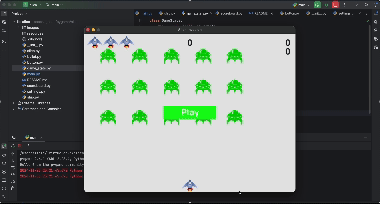

**# Alien Invasion**

A Python-Based Pygame Game

**Features:**

* **Scoring System:** Track your progress and aim for the highest score.
* **High Score Tracking:** Compete with yourself and see how far you can go.
* **Level Advancement:** Conquer challenging levels as you progress.
* **Dynamic Movement and Animations:** Experience smooth and engaging gameplay.
* **Keyboard Controls:** Easily navigate and interact with the game.

**Gameplay:**



**License:**

This project is licensed under the MIT License. Feel free to use and modify the code as you wish.

**To Run the Game:**

1. **Install Required Libraries:**
   ```bash
   pip install pygame
   ```
2. **Run the Main Script:**
   ```bash
   python main.py
   ```

**Contributing:**

We welcome contributions to improve the game. Feel free to fork the repository and submit pull requests.

**Enjoy the Game!**
